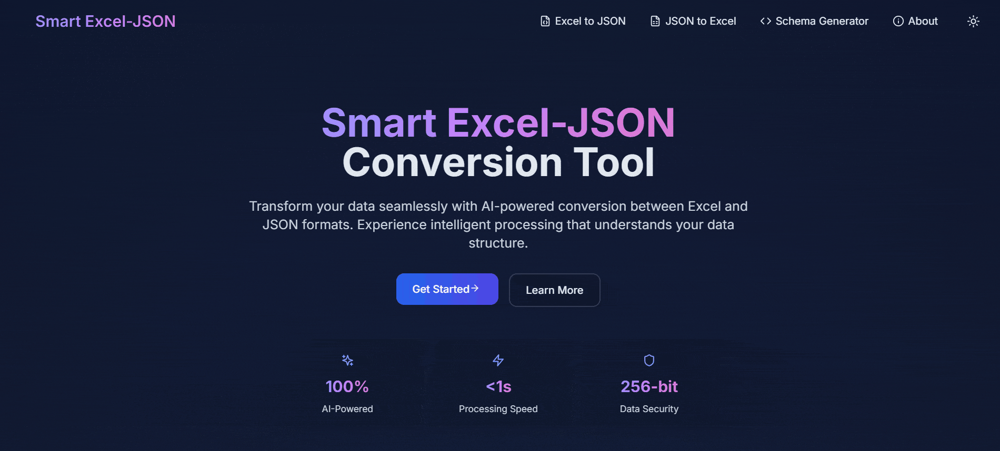

# 🧠 Smart Excel-JSON Tool (Full Stack Monorepo)

[](https://www.oracle.com/java/)
[](https://spring.io/projects/spring-boot)
[](https://reactjs.org/)
[](https://tailwindcss.com/)
[](https://vitejs.dev/)
[](https://www.smartexceljson.live)
[](https://smartexceljson.me)

> Full-stack AI-powered Excel ↔ JSON conversion tool featuring a responsive React frontend and a reactive Spring Boot backend. Built for Scaler Neovarsity Capstone submission.

---

## ✨ Live Demo



- 🔗 Frontend: [https://www.smartexceljson.live](https://www.smartexceljson.live)
- 🔗 Backend: [https://smartexceljson.me](https://smartexceljson.me)

---

## 📁 Repository Structure

```
smart-excel-json-tool-submission/
├── backend/    # Spring Boot backend project
├── frontend/   # React + Vite frontend project
```

---

## 🔥 Core Features

- ✅ Excel ➝ JSON conversion (multi-sheet support)
- ✅ JSON ➝ Excel (with AI-modified cell highlights + tooltips)
- ✅ AI-based JSON schema generation from Excel preview
- ✅ Gemini AI integration for data cleaning + insights
- ✅ Caching, rate limiting, async processing (Mono)
- ✅ Fully responsive animated UI (Framer Motion, Tailwind)
- ✅ Base64 downloads, Monaco Editor, JSON Viewer

---

## 🧪 Backend API Endpoints

All APIs live at: `https://smartexceljson.me`

| Endpoint            | Method | Description                             |
|---------------------|--------|-----------------------------------------|
| `/excel-to-json`    | POST   | Upload Excel, get JSON (raw/AI)         |
| `/json-to-excel`    | POST   | Upload JSON, get Excel (with AI markup) |
| `/generate-schema`  | POST   | Generate JSON schema from Excel         |

---

## 🧰 Frontend Stack

- **React 18.3.1**, **TypeScript**, **Vite 5.4.2**
- Tailwind CSS, Framer Motion, Lucide React
- Monaco Editor, React JSON View Lite
- React Dropzone, Axios

---

## ⚙️ Backend Stack

- Java 21, Spring Boot 3.2.4
- Spring WebFlux (Reactive)
- Apache POI, Gemini API (Google)
- Caffeine Cache, Bucket4j, Dockerized

---

## ▶️ How to Run Locally

### 🔧 Backend

```bash
cd backend
cp src/main/resources/application.properties.example src/main/resources/application.properties
# Add your Gemini API key in the properties file
./mvnw clean install
./mvnw spring-boot:run
```

### 🔧 Frontend

```bash
cd frontend
npm install
echo "VITE_API_BASE_URL=https://smartexceljson.me" > .env
npm run dev
```

---

## 📘 License

MIT — [Suman Kumar](https://github.com/SumanKumar5)
